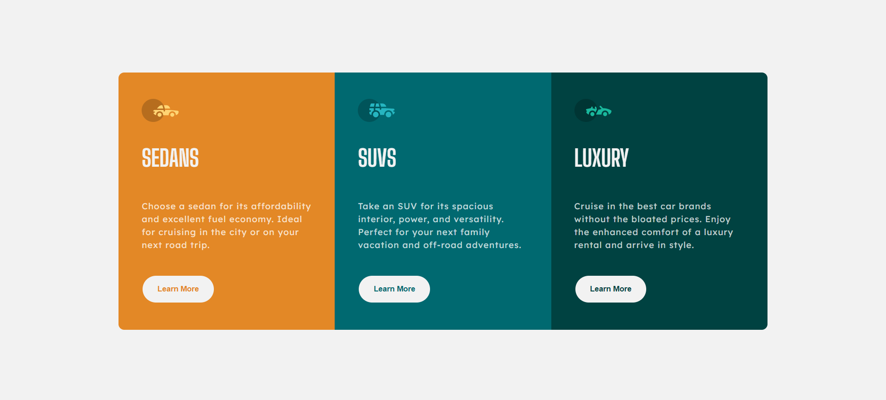

# Frontend Mentor - 3-column preview card component solution

This is a solution to the [3-column preview card component challenge on Frontend Mentor](https://www.frontendmentor.io/challenges/3column-preview-card-component-pH92eAR2-). Frontend Mentor challenges help you improve your coding skills by building realistic projects.

## Table of contents

- [Overview](#overview)
  - [The challenge](#the-challenge)
  - [Screenshot](#screenshot)
  - [Links](#links)
- [My process](#my-process)
  - [Built with](#built-with)
  - [Continued development](#continued-development)
- [Author](#author)

## Overview

### The challenge

Users should be able to:

- View the optimal layout depending on their device's screen size
- See hover states for interactive elements

### Screenshot

### Links

- Solution URL: [https://github.com/Rebeca-RaGe/frontend-mentor-3-column-card](https://github.com/Rebeca-RaGe/frontend-mentor-3-column-card)
- Live Site URL: [https://rebeca-rage.github.io/frontend-mentor-3-column-card/](https://rebeca-rage.github.io/frontend-mentor-3-column-card/)

## My process

### Built with

- Semantic HTML5 markup
- CSS custom properties
- Flexbox
- Mobile-first workflow

### Continued development

I am learning UI Design from these challenges. How the colors indicate interactions, how catch your attention with different sizes and how the hierarchy establish importance

## Author

- Website - [Rebeca Gonzalez](https://www.beckycode.com)
- Frontend Mentor - [@Rebeca-RaGe](https://www.frontendmentor.io/profile/Rebeca-RaGe)
